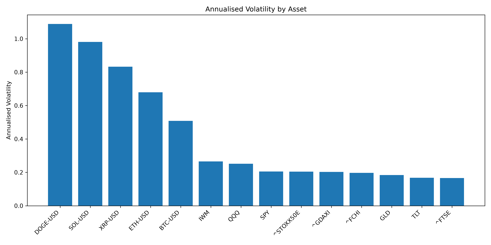
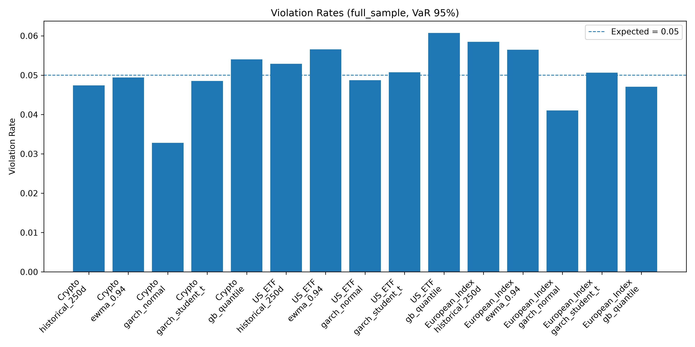
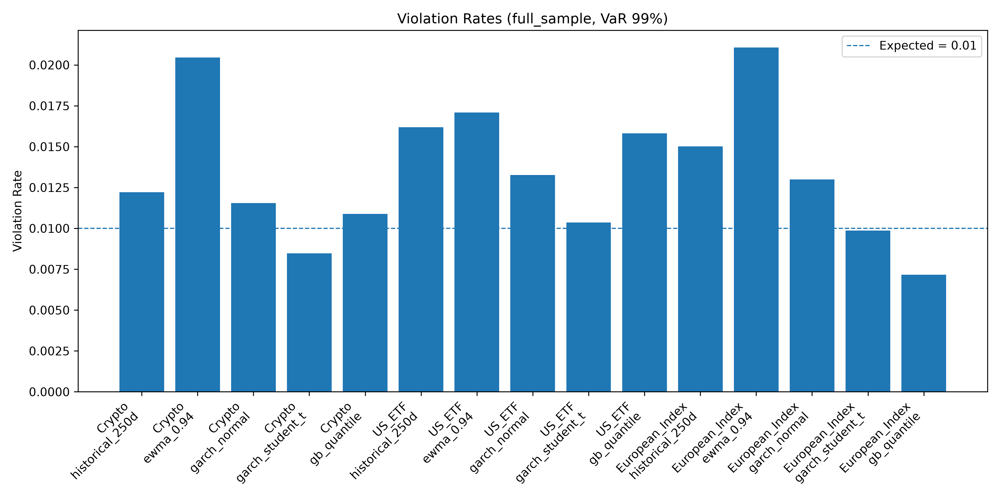
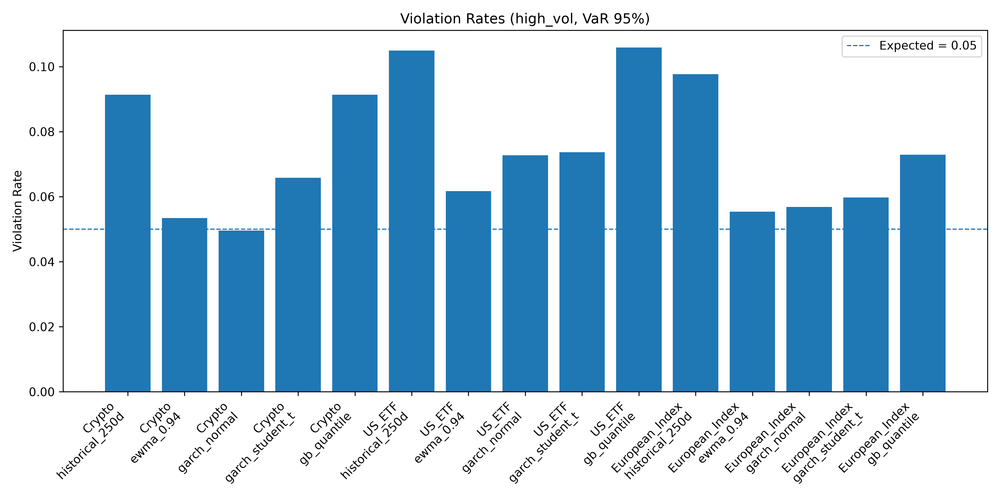
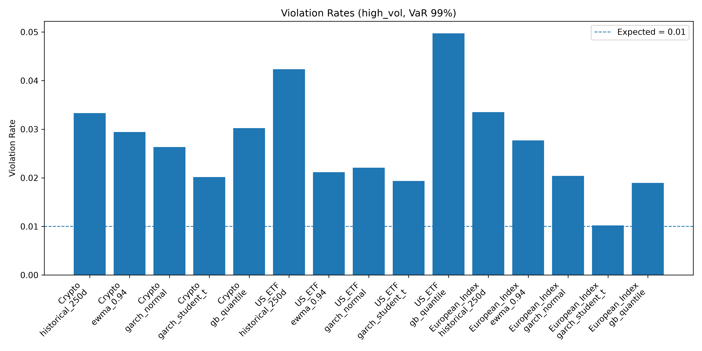
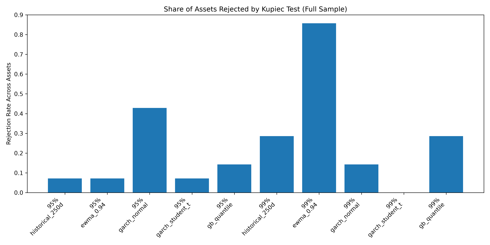

# Cross-Asset Volatility Forecasting and VaR Backtesting

This project compares traditional statistical models and machine learning models for one-day Value-at-Risk (VaR) forecasting across US ETFs, European equity indices, and major cryptocurrencies.

The central research question is:

> Can traditional statistical models and machine learning models improve VaR forecasting across different asset classes, especially during high-volatility market regimes?

---

## Project Overview

The project builds a reproducible Python-based market risk pipeline covering:

* Daily market data collection
* Return and volatility feature engineering
* Asset-specific high-volatility regime classification
* One-day-ahead 95% and 99% VaR forecasting
* VaR backtesting using violation rates and Kupiec unconditional coverage tests
* Comparison between traditional assets and cryptocurrencies
* Full-sample and high-volatility regime analysis

The project is designed as an applied quantitative risk study rather than a trading strategy.

---

## Asset Universe

The analysis covers 14 assets across three market groups.

### US ETFs

* SPY: S&P 500 ETF
* QQQ: Nasdaq 100 ETF
* IWM: Russell 2000 ETF
* TLT: Long-term US Treasury ETF
* GLD: Gold ETF

### European Equity Indices

* FTSE 100
* DAX
* CAC 40
* Euro Stoxx 50

### Major Cryptocurrencies

* BTC-USD
* ETH-USD
* SOL-USD
* DOGE-USD
* XRP-USD

Daily data is used throughout the project.

---

## Models

The project compares five VaR forecasting models.

### Historical Simulation

A rolling 250-day empirical quantile model.

### EWMA Normal VaR

An exponentially weighted moving average volatility model with a Normal return assumption.

### GARCH-Normal

A GARCH(1,1) conditional volatility model with Normal innovations.

### GARCH-Student-t

A GARCH(1,1) conditional volatility model with Student-t innovations to capture heavier tails.

### Gradient Boosting Quantile VaR

A machine learning quantile regression model that directly estimates the 5% and 1% conditional return quantiles.

---

## Backtesting Methodology

For each model and asset, the project computes:

* 95% one-day VaR
* 99% one-day VaR
* VaR violation rates
* Kupiec unconditional coverage test
* Full-sample performance
* High-volatility regime performance

A violation occurs when the realised daily return is below the predicted VaR threshold.

To ensure a fair comparison, models are evaluated on common forecast dates within each asset.

---

## High-Volatility Regime Definition

High-volatility regimes are defined using an asset-specific realised volatility threshold.

For each asset:

> A high-volatility day is defined as a day where the 20-day realised volatility is above that asset's 80th percentile.

This avoids applying the same absolute volatility threshold to assets with very different risk profiles, such as SPY and DOGE.

The high-volatility regime is used as an ex-post stress-period classification for model evaluation, not as an input to the real-time forecasting model.

---

## Key Findings

### 1. Cryptocurrencies have substantially higher realised volatility than traditional assets.

The realised volatility analysis shows that DOGE, SOL, XRP, ETH, and BTC have much higher annualised volatility than US ETFs and European equity indices.



---

### 2. GARCH-Student-t provides the strongest full-sample VaR coverage.

In full-sample backtesting, GARCH-Student-t performs consistently well across Crypto, US ETF, and European Index groups.

It provides violation rates close to the theoretical 5% and 1% levels for both 95% and 99% VaR.





---

### 3. EWMA-Normal performs poorly at the 99% VaR level.

EWMA-Normal gives reasonable 95% VaR coverage in some settings, but it systematically underestimates 99% tail risk.

This is consistent with the limitation of using a Normal distribution for heavy-tailed financial returns.

---

### 4. Historical Simulation VaR fails during high-volatility regimes.

Historical Simulation performs reasonably in some full-sample 95% VaR tests, but its performance deteriorates sharply during high-volatility regimes.

This suggests that a rolling historical quantile can adjust too slowly when markets transition into stressed conditions.





---

### 5. Machine learning quantile VaR is competitive in some full-sample settings but unstable under stress.

The Gradient Boosting quantile model performs competitively for cryptocurrencies in the full sample. However, it does not dominate GARCH-Student-t and performs poorly during high-volatility regimes.

This suggests that direct machine learning quantile models may capture average conditional tail behaviour, but remain sensitive to regime instability and limited extreme-tail observations.

---

### 6. Kupiec rejection rates support the superiority of GARCH-Student-t in the full sample.

The Kupiec rejection-rate summary shows that GARCH-Student-t has the lowest rejection rate across assets, especially at the 99% VaR level.



---

## Project Structure

```text
cross-asset-var-backtesting/
│
├── README.md
├── requirements.txt
├── .gitignore
│
├── data/
│   ├── raw/
│   └── processed/
│
├── notebooks/
│
├── src/
│   ├── data_loader.py
│   ├── features.py
│   ├── regimes.py
│   ├── var_models.py
│   ├── ml_var_models.py
│   ├── backtesting.py
│   ├── metrics.py
│   └── plots.py
│
├── figures/
│   ├── realised_volatility_by_asset.png
│   ├── full_sample_violation_rate_95.png
│   ├── full_sample_violation_rate_99.png
│   ├── high_vol_violation_rate_95.png
│   ├── high_vol_violation_rate_99.png
│   └── full_sample_kupiec_rejection_rate.png
│
└── reports/
```

---

## How to Run

Create and activate a virtual environment:

```bash
python -m venv .venv
```

On Windows PowerShell:

```bash
.\.venv\Scripts\Activate.ps1
```

Install dependencies:

```bash
pip install -r requirements.txt
```

Run the project pipeline:

```bash
python src\data_loader.py
python src\features.py
python src\regimes.py
python src\var_models.py
python src\ml_var_models.py
python -c "from src.backtesting import build_backtest_results; build_backtest_results(input_path='data/processed/var_forecasts_with_ml.csv', output_path='data/processed/backtest_results_with_ml.csv')"
python src\plots.py
```

---

## Main Output Files

Generated CSV files are stored locally under `data/processed/` and are not committed to GitHub.

Main generated outputs include:

```text
data/processed/features.csv
data/processed/regime_features.csv
data/processed/var_forecasts_all.csv
data/processed/var_forecasts_ml.csv
data/processed/var_forecasts_with_ml.csv
data/processed/backtest_results_with_ml.csv
```

Figures are saved under:

```text
figures/
```

---

## Limitations

This project uses daily data only. It does not model intraday liquidity, bid-ask spreads, slippage, exchange-level crypto fragmentation, or order-book depth.

The high-volatility regime classification is ex-post and is used for evaluation, not as a real-time trading signal.

Machine learning models are limited by the small number of extreme tail observations, especially for 99% VaR.

The project focuses on single-asset VaR rather than portfolio-level VaR.

---

## Summary

The main empirical result is that GARCH-Student-t provides the most robust full-sample VaR coverage across US ETFs, European equity indices, and major cryptocurrencies.

However, all models become less reliable during high-volatility regimes, particularly at the 99% VaR level. This highlights the importance of heavy-tailed, regime-aware, and stress-tested risk modelling in cross-asset market risk applications.
